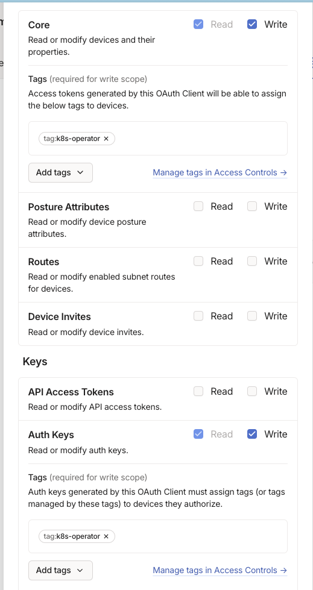

# Tailscale + K8s

This doc is a work in progress

Notes:

https://tailscale.com/kb/1185/kubernetes
https://tailscale.com/kb/1236/kubernetes-operator

```yaml
"tagOwners": {
    "tag:k8s-operator":  ["group:ops"],
    "tag:k8s":           ["group:ops", "tag:k8s-operator"],
    "tag:k8s-public":    ["group:ops", "tag:k8s-operator"],
}
```

Oauth client settings ([prerequisites](https://tailscale.com/kb/1236/kubernetes-operator#prerequisites)):


